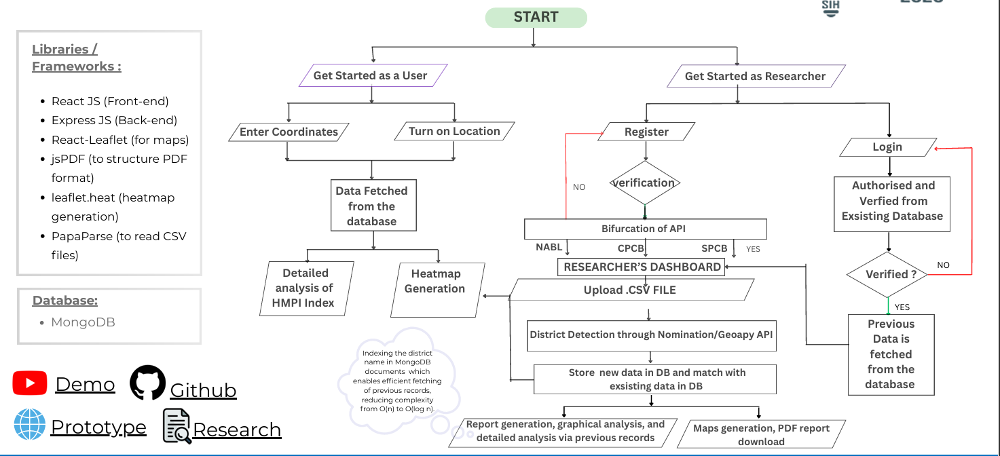
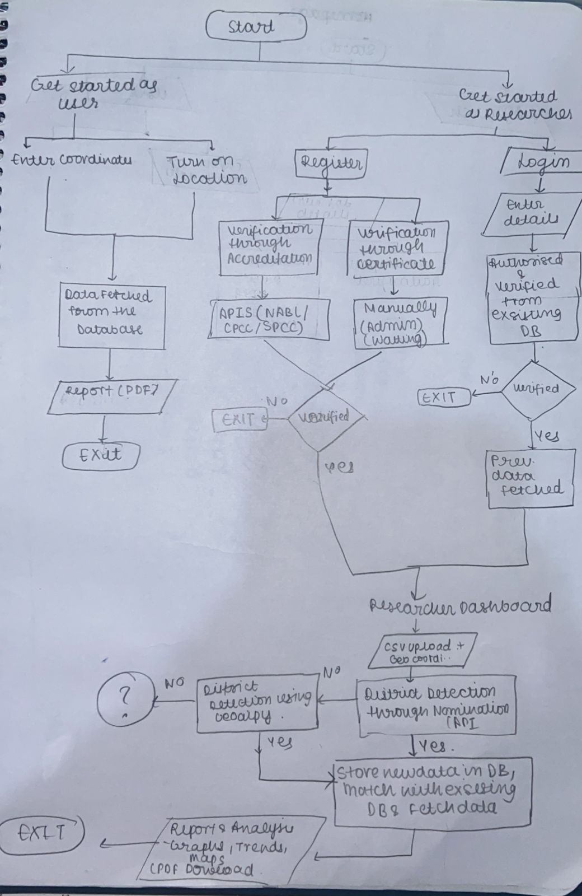

# 🌍 HMPI – AI-Driven Environmental Intelligence Platform (Prototype)

> A frontend prototype demonstrating how AI can transform verified lab data into
> accurate predictions, reduced manual effort, and smarter environmental decisions.

---

## 🚀 Project Overview

HMPI is a **frontend-first prototype** designed to showcase an **AI-centric approach**
to solving real problems faced by researchers and laboratories:

- manual HMPI calculations  
- repetitive report generation  
- fragmented historical data  
- lack of predictive insights  

> *Our focus is not just calculation — it is understanding, prediction, and prevention.*

---

## 🎯 Problem Statement (SIH Context)

Researchers currently:
- perform **manual calculations**
- face **human errors**
- lack **historical & predictive context**
- work with **isolated datasets**

This prototype demonstrates how an AI-driven system can:
- automate analysis
- reduce errors
- efficiently reuse historical data
- support future decision-making

---

## 📊 TECHNICAL APPROACH (UI Prototype)

## 📊 TECHNICAL APPROACH (INITIAL APPROACH)

## 🧠 Core Idea: AI-Centric Architecture (Conceptual)

> ⚠️ **Note:**  
> The AI model and backend pipelines described below are **conceptual designs**  
> intended to demonstrate feasibility and future scope.  
> They are **not fully implemented** in this prototype.

### What the AI Model Is Designed To Do
- 📈 Predict future HMPI / pollution trends
- 🚨 Detect anomalies in lab data
- 📊 Learn from historical, district-level datasets
- 🧩 Convert raw lab uploads into actionable insights

> *The AI model is the engine — everything else supports it.*

---

## 🖥️ Current Implementation Status

### ✅ Implemented (Frontend Prototype)
- Researcher dashboard UI
- CSV upload interface (mocked flow)
- HMPI calculation visualization
- Graphs & analytical views
- Heatmap & map-based visualization
- File history & activity UI
- Clean, responsive design (SIH-ready)

### 🧠 Conceptual / Planned
- Backend APIs
- Database pipelines
- AI/ML models
- Lab verification APIs
- Large-scale indexing & optimization

---

## 🏗️ Proposed System Architecture (Design)

### 🗄️ Databases (Conceptual)
- **MongoDB (NoSQL)**  
  - Raw CSV uploads  
  - Flexible lab schemas  
  - High-volume ingestion  

- **PostgreSQL + PostGIS**  
  - Clean structured data  
  - Spatial queries (district-wise)  
  - Required for AI training  

> MongoDB stores **what is uploaded**  
> SQL stores **what the AI learns from**

---

## 📍 Geo-Intelligence (Conceptual)

- CSV files contain only **latitude & longitude**
- Reverse geocoding APIs determine **district automatically**
- Enables:
  - district-level analysis
  - historical comparisons
  - map-based intelligence

**Planned APIs**
- OpenStreetMap Nominatim (free)
- Geoapify / LocationIQ (optional)

---

## 🔐 Lab Verification (Design Idea)

Planned verification via:
- NABL
- CPCB
- SPCB

Goal:
- prevent fake lab uploads
- ensure data credibility
- build national-level trust

---

## 📊 Key Features (Prototype + Vision)

- 📂 CSV upload flow (UI)
- 🧮 Automated HMPI visualization
- 🗺️ Heatmaps & spatial analysis
- 📉 Trend graphs
- 📄 Report preview UI
- 🧠 AI prediction (conceptual)
- 🕒 Upload history & activity tracking

---

## ⚡ Scalability & Performance (Design)

- Indexed district-level searches
- TB-scale data handling (conceptual)
- Fast historical lookups using indexing
- Optimized for government-scale datasets

> *Designed today to scale tomorrow.*

---

## 🔁 Version Control Strategy (Planned)

- Code versioning via GitHub
- AI model versioning (rollback support)
- Dataset version tracking
- Admin moderation & audit trails

---

## 🌱 Future Scope (AI-First Vision)

- 🔮 Pollution forecasting
- 🏭 Industrial compliance analytics
- 🏙️ Policy & urban planning insights
- 🧪 Research & startup APIs
- 💧 Smart purifier & IoT integration

> *From raw data → intelligence → prevention.*

---

## 🧩 Tech Stack (Prototype)

- **Frontend**: React.js, Tailwind CSS
- **Visualization**: Recharts, Leaflet
- **Design Focus**: UX for researchers
- **Backend & AI**: Conceptual (proposed)

---

## 🏁 Final Note

> *This project is a **proof-of-concept frontend prototype** built to demonstrate how
> an AI-driven environmental intelligence system can reduce manual effort, minimize
> errors, and unlock the true value of research data.*

⭐ Built for **Smart India Hackathon (SIH)**  

## 📄 Project Report

- 📘 **Detailed Project Documentation**  
  👉 [View Project Report](https://docs.google.com/document/d/1-cQ1FuuxI6u5HTCliN1rtstws1-WP89AdUBkKXmABq4/edit?usp=sharing)

## 🎥 Demo Video BY TEAM MEMBER - KANISHKA

▶️ **Project Walkthrough & UI Demonstration**  
👉 [Watch on YouTube](https://youtu.be/v_2_HNxC8gE?si=E_r0Zs5V_VbUIF97)

